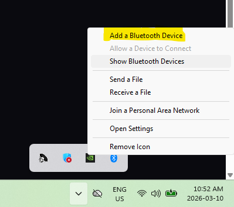
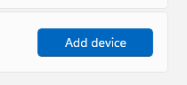
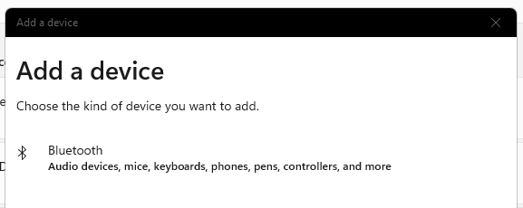
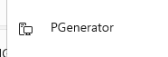
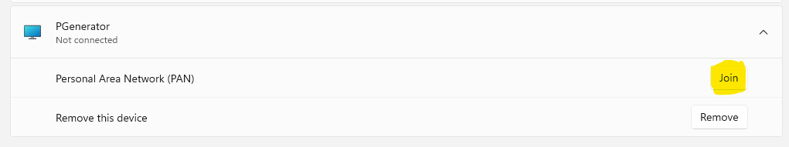
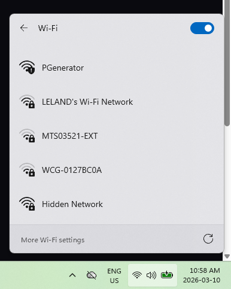
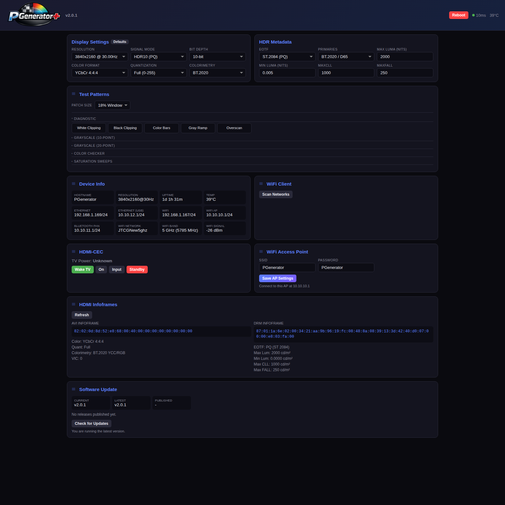

# PGenerator+

<p align="center">
  
</p>

A Raspberry Pi–based HDMI test pattern generator for display calibration. PGenerator+ outputs precision color patches and test patterns over HDMI — including HDR10, HLG, and Dolby Vision — controlled remotely by calibration software over TCP/IP.

Built on [PGenerator](https://github.com/Biasiolo/PGenerator) by Riccardo Biasiotto.

## Installation & Updates

### How to Flash the Image

1. Download the latest full image release parts (`PGenerator_Plus_vX.Y.Z.img.7z.001` and `.002`) from the GitHub Releases page and place both files in the same folder.
2. Extract the first part with [7-Zip](https://www.7-zip.org/) to reconstruct the full `.img` file, then flash it with a tool like [Balena Etcher](https://etcher.balena.io/) or [Rufus](https://rufus.ie/) to a microSD card or USB flash drive (minimum 8GB).
3. Insert the microSD card or USB flash drive into your Raspberry Pi and power it on.
4. Connect to the Pi using one of the following methods:
   - **Bluetooth PAN:**
     1. First connect to the Bluetooth device on your computer.

        <p align="left">
          
          
          
          
        </p>

     2. Join its PAN in Windows settings.

        <p align="left">
          
        </p>

   - **Wired PAN:** Connect an Ethernet cable directly between your device and the Pi.
   - **Wired LAN:** Connect the Pi to your local network router or switch via Ethernet.
   - **Wireless PAN:** Connect your device to the Pi's default WiFi Access Point (SSID: `PGenerator`, Password: `PGenerator`).

     <p align="left">
       
     </p>

   - **Wireless LAN:** Connect the Pi to your existing WiFi network (can be configured via the Web UI after using one of the other methods).
5. Access the web UI at `http://pgenerator.local` or the device's IP address.

### How to Update (OTA)

PGenerator+ includes a built-in Over-The-Air (OTA) update system that pulls the latest releases directly from GitHub.

**Via Web UI (Recommended):**
1. Open the PGenerator+ web dashboard.
2. Scroll down to the **Software Update** card.
3. Click **Check for Updates**. If a new version is available, the changelog will appear.
4. Click **Install Update**. The device will download the update, apply it, and restart automatically.

**Via Command Line:**
You can also trigger updates via SSH (`root` / `PGenerator!!$`):
```bash
# Check for updates
/usr/sbin/pgenerator-update check

# Apply the latest update
/usr/sbin/pgenerator-update apply
```

---

## Features

### Signal Modes

| Mode | Description |
|------|-------------|
| **SDR** | Standard Dynamic Range (Rec.709), 8-bit |
| **HDR10** | Static HDR with PQ (ST.2084) EOTF, 10-bit, full DRM InfoFrame metadata |
| **HLG** | Hybrid Log-Gamma for broadcast HDR, 10-bit |
| **Dolby Vision (Low Latency)** | LLDV with RPU metadata, 12-bit — recommended for DV calibration |

The Raspberry Pi 4's KMS driver is used to set HDMI InfoFrames directly:

- **AVI InfoFrame** — color format (RGB / YCbCr 4:4:4 / 4:2:2), colorimetry (BT.709 / BT.2020), bit depth
- **DRM InfoFrame** — EOTF, mastering display primaries (Rec.2020 / P3), luminance (max/min), MaxCLL, MaxFALL
- **Dolby Vision** — DOVI output metadata blob via a dedicated binary (`PGeneratord.dv`) that detects DV capability from the display's EDID VSVDB

### Calibration Software Compatibility

PGenerator+ acts as a TCP-controlled pattern generator, compatible with many major calibration software packages.

**1. Calman (Portrait Displays)**
- **Protocol:** SpectraCal Unified Pattern Generator Control Interface (Port `2100`)
- **How to Connect:** In your workflow, click **Find Source** → Manufacturer: `SpectraCal` (or `Portrait Displays` in some versions) → Model: `SpectraCal - Unified Pattern Generator Control Interface`. Enter the PGenerator's IP address and click Connect.
  - *Calman Control:* When connected via UPGCI, Calman can directly command the PGenerator to switch between SDR, HDR10 and HLG signal modes, set the EOTF, colorimetry, color format, mastering display metadata, and other InfoFrame parameters — all from the Calman Source Settings tab. PGenerator executes these commands in real time, eliminating the need to manually configure the signal on the device.
  - *10-bit HDR Workflows:* PGenerator+ extends the original 8-bit Calman integration with automatic 10-bit handling for HDR workflows, keeping the pattern path aligned with the active HDMI link so HDR10 measurements run at full precision.
  - *Window and APL Handling:* PGenerator+ supports both older and newer Calman window-generation methods on the Raspberry Pi, including fixed windows, custom windows, and gray-surround APL behavior used by G1-style workflows.
  - *Session Safety:* Pattern state is cleared on session start, shutdown, and disconnect events so window or background settings do not leak into the next calibration run.
  - *Dolby Vision Support:* Calman's Dolby Vision controls now switch the Pi into the correct Low-Latency Dolby Vision output path with matching HDMI signaling, BT.2020 colorimetry, and stable runtime metadata handling.
  - *Pi Workflow Compatibility:* PGenerator+ covers the Calman control paths used in real Raspberry Pi workflows, including newer auxiliary control behavior, without requiring separate manual setup.
  - *Compatibility Note:* In some Calman builds, connection may also work through the same source entry users normally use for the G1. PGenerator+ is an independent community project, is not affiliated with or endorsed by Portrait Displays, and is documented here as a compatibility option rather than as official G1 hardware. Users are responsible for ensuring their Calman license and workflow comply with applicable vendor terms.
  - *Deprecation Notice:* Portrait Displays removed the UPGCI protocol from Calman "Home" licenses starting with version 5.15.x (the 2024 releases) to push users toward their own generator hardware. There is no official add-on to re-enable it for Home users. If calibration with PGenerator is required, you must either remain on Calman 5.14.x or older, upgrade to a professional license tier (Calman Video Pro or higher), or use alternative software (like ColourSpace or HCFR).

**2. ColourSpace / LightSpace CMS**
- **Protocol:** XML Network Calibration Protocol (Port `85`)
- **How to Connect:** Open **Hardware Options** → Hardware: `Network` (or `PGenerator` if listed). Enter the PGenerator's IP address in the Network Address field and click Connect.

**3. HCFR**
- **Protocol:** Network Pattern Generator Commands (Port `85`)
- **How to Connect:** Go to **Measures** > **Generator** > **Configure** → Select `Network` from the dropdown and enter the PGenerator's IP address.

**4. Resolve Protocol (CalMAN/HCFR/DisplayCAL)**
- **Protocol:** XML Calibration Protocol (Port `20002`) — PGenerator+ acts as a *client*, connecting outbound to calibration software. This is useful when the calibration PC cannot reach the PGenerator directly (e.g., different subnets).
- **How to Connect:** In the PGenerator+ Web UI, find the **Resolve Protocol** card, enter the calibration PC's IP address and port, and click **Connect**. PGenerator+ will establish a TCP connection and begin accepting XML-encoded pattern commands.
- **Windows Redirect Helper:** For CalMAN workflows that expect a local Resolve connection, use the included `tools/PGenerator-Resolve-Redirect.bat` to set up a Windows port proxy that forwards CalMAN's local port 20002 to the PGenerator's IP.

**5. DeviceControl**
- **Protocol:** UDP discovery + TCP pattern control

*Device Discovery:* Calibration software can often discover the device automatically via UDP broadcast on port `1977` (`"Who is a PGenerator"` → `"I am a PGenerator <name>"`), allowing you to select your device from a list instead of entering the IP address manually. On PGenerator+, the advertised discovery name defaults to `PGenerator+` when the system hostname is still the stock `pgenerator` value.

### Web UI Dashboard

PGenerator+ features a responsive, mobile-friendly single-page settings dashboard served on **port 80**. Access it from any browser at `http://pgenerator.local` or using the device's IP address.

<p align="center">
  
</p>

The UI is divided into drag-and-drop functional cards that save your layout preferences locally.

#### Device Information
Monitor the real-time health and connectivity of your PGenerator+:
- **System Metrics:** Uptime, CPU temperature, and active HDMI output resolution.
- **Network Interfaces:** View all assigned IP addresses (Ethernet, WiFi, WiFi AP, and Bluetooth PAN).
- **WiFi Status:** Detailed metrics on the current wireless network connection including SSID, band, and signal strength.
- **Calibration Status:** Auto-detects and displays when calibration software (like Calman or ColourSpace) is actively connected.
- **Latency Indicator:** Live ping response time to the device with a color-coded status.

#### HDMI Signal Settings
Complete control over the HDMI output parameters, InfoFrames, and DRMs without needing to use terminal commands:
- **Signal Mode:** Instantly switch between SDR, HDR10, HLG, and Dolby Vision.
- **Custom Resolutions:** Auto-detects available modes from the connected display's EDID.
- **Base Video Parameters:** Configure Color Format (RGB/YCbCr), Colorimetry (BT.709/BT.2020), and Bit Depth (8/10/12-bit).
- **HDR10 Metadata:** When HDR10 is active, take full control over the DRM InfoFrame (EOTF, Mastering Primaries, Max/Min Luma, MaxCLL, and MaxFALL).
- **Dolby Vision Metadata:** Dolby Vision Low Latency (LLDV) is supported, configure specific DOVI Interface, Color Space, and Metadata details.

#### Manual Pattern Injection
A full suite of test patterns that can be manually injected on-screen for spot-checking and fast visual validation.
- **Solid Colors:** White, Black, Red, Green, Blue, Cyan, Magenta, Yellow, and generic Grays.
- **Ramps & Steps:** Grayscale ramps and varying steps (2% to 10% increments).
- **Calibration Checks:** Window patterns, Overscan borders, and Color Bars.
- **Custom RGB Patch:** Enter specific RGB triplets and pick a patch size (10%, 18%, 25%, 50%, or 100%) to instantly display a custom color window.

#### InfoFrame Decoder
Troubleshoot your display chain by reading exactly what InfoFrames the Raspberry Pi is writing to the HDMI port:
- Live readout of active AVI and DRM InfoFrame hex data.
- Decoded human-readable translation of the current signal flags (colorimetry, VIC, EOTF, and luminance).

#### HDMI-CEC TV Control
Direct display control using HDMI-CEC:
- **TV Power Status:** Indicates if the TV is detected and turned On/Standby.
- **Actions:** Wake, Turn On, Send to Standby, or force the TV to switch to the Active Input.

#### System & Updates
Manage the device directly from the interface:
- **Network Management:** Configure the active WiFi client connection or manage the local WiFi Access Point (reachable at `10.10.10.1`).
- **Power Options:** Restart the PGenerator backend service or safely reboot the entire Raspberry Pi.
- **OTA Updates:** Check GitHub for new PGenerator+ releases, view changelogs, and sequentially download/extract updates with a single click.

### mDNS / Bonjour

Built-in mDNS responder on port 5353 — the device is reachable at `pgenerator.local` without any DNS configuration. Responds to A-record queries with subnet-aware IP selection.

### OTA Updates

Self-updating via GitHub Releases from this repository:

- `pgenerator-update check` — queries the GitHub API for the latest release, returns JSON with version comparison and changelog
- `pgenerator-update apply` — downloads the release `.tar.gz` asset, stops the service, extracts over the filesystem, and restarts

Updates are triggered from the web UI or command line. Release assets are tar.gz archives with FHS-layout paths that overlay directly onto the root filesystem.

### LUT Correction

Per-channel color correction via `/etc/PGenerator/lut.txt`:

```
R,G,B=R_delta,G_delta,B_delta
```

Supports exact RGB matches and an `ALL` wildcard for global offset. Applied by the Perl daemon before writing pattern files.

---

## Architecture

```
Boot: /etc/init.d/rcPGenerator → /etc/init.d/PGenerator
  ↓
Splash: RGB565 framebuffer image → /dev/fb0 (1920×1080)
  ↓
Hardware init: USB gadget, WiFi AP, Bluetooth, DHCP
  ↓
Daemon: PGeneratord.pl (Perl TCP server)
  ├─ TCP port 85   — LightSpace / pattern protocol
  ├─ TCP port 2100 — Calman protocol
  ├─ TCP port 2101 — RPC service
  ├─ TCP port 80   — Web UI (HTTP + JSON API)
  ├─ UDP port 5353 — mDNS responder
  ├─ UDP port 1977 — Device discovery
  ├─ UDP port 3529 — RPC discovery
  ├─ Spawns PGeneratord (C/C++ renderer, reads operations.txt)
  │    └─ PGeneratord.dv variant for Dolby Vision
  └─ Threads: main loop, device info, UDP discovery (x3), Resolve client, HTTP, mDNS
```

### IPC

The Perl daemon writes pattern descriptions to `/var/lib/PGenerator/operations.txt` in a simple DSL:

```
PATTERN_NAME=TestPattern
BITS=8
DRAW=RECTANGLE
DIM=1920,1080
RGB=255,128,0
BG=0,0,0
POSITION=0,0
END=1
FRAME=1
```

The C/C++ binary (`PGeneratord`) reads this file and renders directly to the display via the Pi's GPU.

### Privilege Separation

The daemon runs as the `pgenerator` user. Privileged operations (config writes, service control, updates) are delegated to `PGenerator_cmd.pl` via `sudo`, with arguments passed as base64-encoded environment variables.

---

## Project Structure

```
etc/
  init.d/PGenerator              # Init script (service start/stop)
  PGenerator/PGenerator.conf     # Configuration (key=value)
  PGenerator/lut.txt             # LUT color correction table
usr/
  sbin/
    PGeneratord.pl               # Main daemon (Perl, forks + threads)
    PGeneratord                  # Pattern renderer (C/C++ binary)
    PGeneratord.dv               # Dolby Vision renderer variant
    pgenerator-update            # OTA update script (GitHub Releases)
  bin/
    PGenerator_cmd.pl            # Privileged command handler (runs as root)
  share/PGenerator/
    daemon.pm                    # TCP server, request routing, thread management
    pattern.pm                   # Pattern file creation, LUT, scaling
    command.pm                   # System commands (HDMI, temp, WiFi, process mgmt)
    client.pm                    # LightSpace / Calman protocol handling
    resolve.pm                   # Resolve calibration XML protocol (client mode)
    discovery.pm                 # UDP broadcast discovery responder
    webui.pm                     # Web UI: HTTP server, JSON API, HTML/CSS/JS SPA
    conf.pm                      # Configuration file parser
    variables.pm                 # Global variables, paths, defaults
    version.pm                   # Version info ($version, $version_plus)
    info.pm                      # Device info collection
    log.pm                       # Logging
    file.pm                      # File utilities
```

### Key Modules

| Module | Purpose |
|--------|---------|
| [daemon.pm](usr/share/PGenerator/daemon.pm) | TCP socket server, fork + thread management, request routing |
| [pattern.pm](usr/share/PGenerator/pattern.pm) | Pattern DSL file creation, LUT application, resolution scaling |
| [command.pm](usr/share/PGenerator/command.pm) | HDMI mode detection (KMS/modetest), 4K auto-select, process management |
| [client.pm](usr/share/PGenerator/client.pm) | LightSpace XML protocol, Calman protocol handling |
| [resolve.pm](usr/share/PGenerator/resolve.pm) | Resolve calibration XML protocol (outbound client to CalMAN/HCFR/DisplayCAL) |
| [discovery.pm](usr/share/PGenerator/discovery.pm) | UDP broadcast discovery for DeviceControl, LightSpace, and RPC |
| [webui.pm](usr/share/PGenerator/webui.pm) | Full web dashboard: HTTP server, REST API, single-page HTML/CSS/JS app |
| [conf.pm](usr/share/PGenerator/conf.pm) | `key=value` configuration file reader/writer |
| [variables.pm](usr/share/PGenerator/variables.pm) | All global paths, defaults, shared state declarations |
| [version.pm](usr/share/PGenerator/version.pm) | Version string (`2.1.1`) and product name (`PGenerator+`) |

---

## Configuration

`/etc/PGenerator/PGenerator.conf` — flat `key=value` format, no sections:

| Key | Values | Description |
|-----|--------|-------------|
| `port_pattern` | `85` | TCP port for pattern protocol (read-only) |
| `color_format` | `0`=RGB, `1`=YCbCr444, `2`=YCbCr422 | HDMI output color format |
| `colorimetry` | `0`=BT.709, `1`=BT.2020 | AVI InfoFrame colorimetry |
| `rgb_quant_range` | `0`=Auto, `1`=Limited, `2`=Full | RGB quantization range |
| `max_bpc` | `8`, `10`, `12` | Bits per channel |
| `eotf` | `0`=SDR, `2`=PQ, `3`=HLG | Electro-optical transfer function |
| `primaries` | `1`=Rec.2020, `2`=P3/D65, `3`=P3/DCI | Mastering display primaries |
| `max_luma` / `min_luma` | nits (min is ×0.0001) | Mastering display luminance |
| `max_cll` / `max_fall` | nits | Content light level metadata |
| `dv_status` | `0`=off, `1`=on | Enable Dolby Vision binary |
| `is_hdr` / `is_sdr` | `0` / `1` | Signal mode flags |
| `is_ll_dovi` / `is_std_dovi` | `0` / `1` | Dolby Vision mode flags |
| `dv_interface` | `0`=Standard, `1`=Low Latency | DV interface type |
| `dv_map_mode` | `1`=Absolute, `2`=Relative | DV source-mapping mode used by the current `.dv` renderer |
| `dv_metadata` | `2`=Perceptual, `3`=Absolute, `4`=Relative | Calman metadata-mode bookkeeping; the current `.dv` renderer uses `dv_map_mode` for live source mapping |
| `dv_color_space` | `0`=YCbCr422, `1`=RGB444, `2`=YCbCr444 | DV color space |

---

## Hardware Requirements

- **Raspberry Pi 4** (or Pi 400) **Highly Recommended** — required for HDR10/DV and KMS driver support, and necessary to comfortably handle the overhead of the added local services (Web UI, active API calls, mDNS, etc.).
- HDMI connection to target display
- Network connection (Ethernet, WiFi, Bluetooth, or WiFi AP mode)

*Note: While older Raspberry Pi models may theoretically boot the image and output SDR, they are not supported or recommended for PGenerator+ due to resource constraints.*

---

## API Reference

All endpoints are served on port 80. Responses are JSON.

| Method | Endpoint | Description |
|--------|----------|-------------|
| GET | `/api/ping` | Health check, returns `{"ok":1}` |
| GET | `/api/info` | Device info (hostname, temp, IPs, WiFi, resolution, calibration status) |
| GET | `/api/config` | Current configuration as JSON |
| POST | `/api/config` | Apply configuration changes (JSON body) |
| GET | `/api/modes` | Available HDMI output modes from display EDID |
| POST | `/api/restart` | Restart pattern generator |
| POST | `/api/reboot` | Reboot device |
| GET | `/api/wifi/scan` | Scan for WiFi networks |
| GET | `/api/wifi/status` | WiFi connection status |
| POST | `/api/wifi/connect` | Connect to WiFi (JSON: ssid, psk) |
| GET | `/api/wifi/ap` | Get AP settings |
| POST | `/api/wifi/ap` | Set AP SSID & password |
| GET | `/api/infoframes` | Read AVI and DRM InfoFrame hex data from HDMI output |
| GET | `/api/cec/status` | HDMI-CEC TV power status |
| GET | `/api/cec/{cmd}` | Send CEC command (wake, on, off, as) |
| POST | `/api/pattern` | Display a test pattern (JSON: name, r, g, b, size) |
| POST | `/api/resolve/connect` | Connect to Resolve calibration server (JSON: ip, port) |
| POST | `/api/resolve/disconnect` | Disconnect from Resolve server |
| GET | `/api/resolve/status` | Resolve connection status |

---

## Based On

PGenerator+ is built on [PGenerator](https://github.com/Biasiolo/PGenerator) by Riccardo Biasiotto, licensed under the GNU General Public License v3.0. The original project provides the core pattern generation engine, TCP protocol handling, and C/C++ renderer binary.

PGenerator+ adds the web-based dashboard, HDR/DV InfoFrame configuration UI, mDNS discovery, HDMI-CEC control, OTA updates via GitHub Releases, Calman 10-bit pattern support, validated Pi-side Calman window/APL handling (`RGB_S`, `RGB_A`, `CommandRGB`, `10_SIZE`, `11_APL`), Dolby Vision renderer-blob preservation with corrected Absolute/Relative handling, stock-hostname discovery branding as `PGenerator+`, automatic bit depth management for HDR/SDR mode switching, and various stability improvements.

---

## License

GNU General Public License v3.0 — see [COPYING](COPYING) for details.
